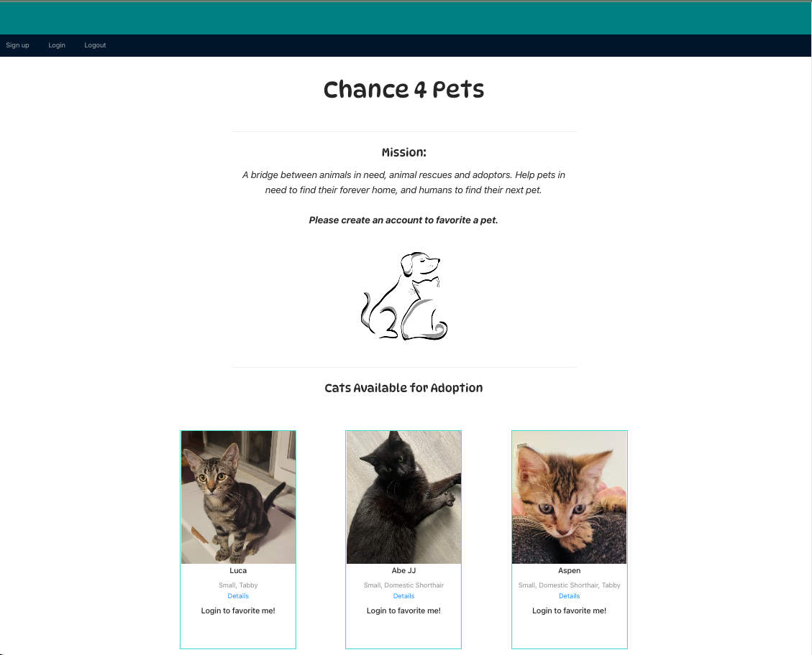

# Chance 4 Pets Web Application

This project is a web application built in React that creates a bridge between the public and animal rescues. It allows users to view cats and dogs available for adoption from local animal rescues, favorite animals, and post information for an animal in need of rescue/shelter intake.

[Live demo](https://animal-rescue-frontend-js.web.app/)

## Preview

### Credits

1. Logo created by Alex Pelta using rucraft

2. Pure CSS Cat Animation: Copyright (c) 2022 by Johan Mouchet (https://codepen.io/johanmouchet/pen/OXxvqM)

Permission is hereby granted, free of charge, to any person obtaining a copy of this software and associated documentation files (the "Software"), to deal in the Software without restriction, including without limitation the rights to use, copy, modify, merge, publish, distribute, sublicense, and/or sell copies of the Software, and to permit persons to whom the Software is furnished to do so, subject to the following conditions:

The above copyright notice and this permission notice shall be included in all copies or substantial portions of the Software.

THE SOFTWARE IS PROVIDED "AS IS", WITHOUT WARRANTY OF ANY KIND, EXPRESS OR IMPLIED, INCLUDING BUT NOT LIMITED TO THE WARRANTIES OF MERCHANTABILITY, FITNESS FOR A PARTICULAR PURPOSE AND NONINFRINGEMENT. IN NO EVENT SHALL THE AUTHORS OR COPYRIGHT HOLDERS BE LIABLE FOR ANY CLAIM, DAMAGES OR OTHER LIABILITY, WHETHER IN AN ACTION OF CONTRACT, TORT OR OTHERWISE, ARISING FROM, OUT OF OR IN CONNECTION WITH THE SOFTWARE OR THE USE OR OTHER DEALINGS IN THE SOFTWARE.